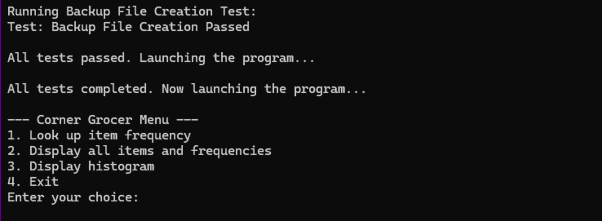
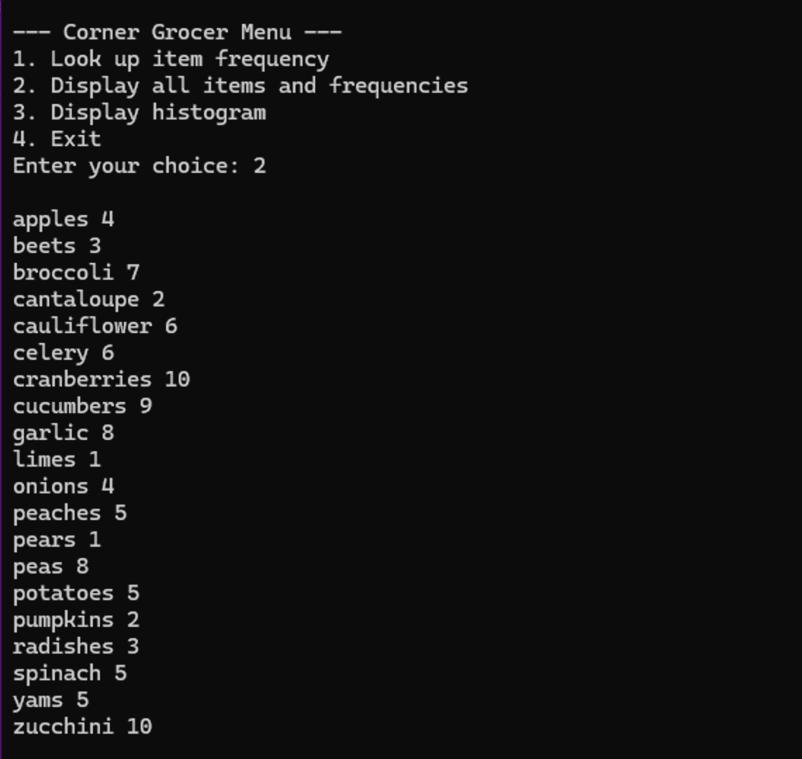
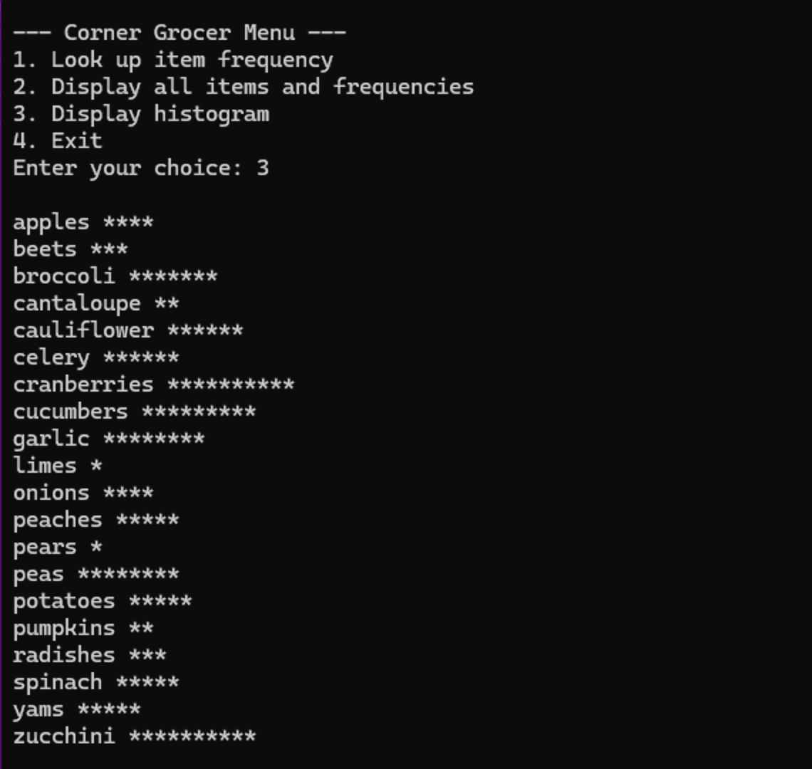
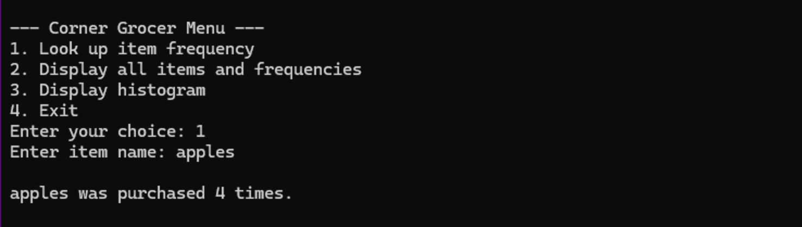
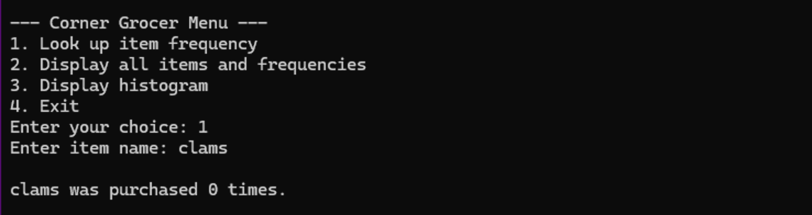
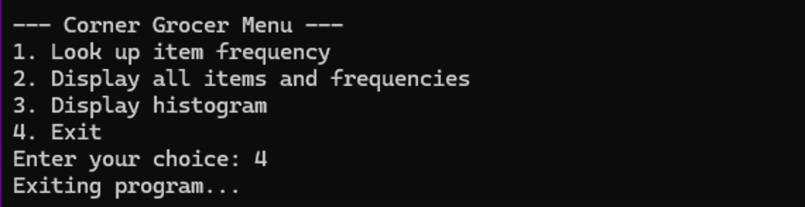
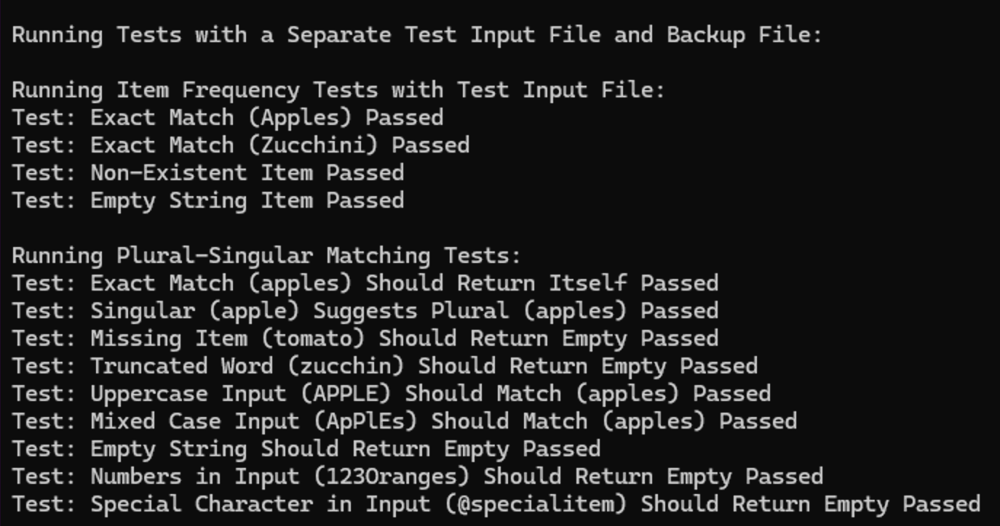
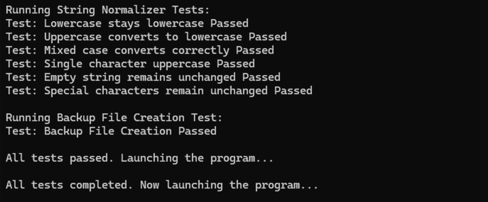

# Corner Grocer Item Tracker

## Overview

The **Corner Grocer Item Tracker** is a C++ program designed to analyze grocery sales data. It reads an input file containing purchased items, calculates purchase frequencies, displays item counts in both list and histogram formats, and stores the results in a backup file (`frequency.dat`). The program ensures efficient data processing while maintaining clean, modular, and testable code.

### Main Menu



## Features

- Reads and processes grocery sales data from an input file.
- Provides an interactive menu to look up item frequencies, display all items, and generate histograms.
- Implements input validation to filter out invalid data.
- Stores processed data in `frequency.dat` for backup.
- Includes a built-in test suite that runs automatically before execution.
- Supports case-insensitive and plural-to-singular item lookups.

### Frequency List Display



### Histogram Display



## Installation

To set up the project on your local machine, follow these steps:

```sh
git clone https://github.com/your-username/corner-grocer-tracker.git
cd corner-grocer-tracker
```

**NOTE:** Ensure a valid input file (CS210_Project_Three_Input_File.txt) is present in the working directory before running the program.

## Compilation and Execution

### Using a C++ Compiler (G++)

To compile and run the program manually:

```sh
g++ -o corner_grocer main.cpp ItemTracker.cpp Utility.cpp Tests.cpp -std=c++11
./corner_grocer
```

### Using Visual Studio

1. Open the project in Visual Studio.
2. Select Build Solution (Ctrl + Shift + B).
3. Run the executable from the Debug folder.

### Usage

Upon execution, the program displays a menu with the following options:

1. Look up an item’s purchase frequency.
2. Display all items and their frequencies.
3. Display item frequencies as a histogram.
4. Exit the program.

Users can enter an item name to check its frequency. The program normalizes input (handling case differences and plural/singular forms). If an item does not exist, it provides feedback accordingly.

#### Lookup Functionality - Singular Item



#### Item Not Found



#### Exit Confirmation



### Testing

The program includes an automated test suite that runs before execution. Tests validate:
• Correct frequency calculations.
• Handling of plural and singular forms.
• Case insensitivity in item lookups.
• Ignoring of invalid entries (numbers, special characters).
• Proper creation of the backup file (frequency.dat).

If any test fails, the program halts and reports the issue.

#### Successful Tests Passing



#### All Tests Passed, Program Starting



## Folder Structure

```text
📁 CornerGrocer                         # Root project folder (Visual Studio solution directory)
│── 📄 CornerGrocer.sln                 # Visual Studio solution file
│── 📁 CornerGrocer                     # Main project folder
│   │── 📄 CornerGrocer.vcxproj         # Visual Studio project file
│   │── 📄 CornerGrocer.vcxproj.filters  # Filters for Visual Studio
│   │── 📄 main.cpp                     # Entry point for the program
│   │── 📄 ItemTracker.h                # Header file for ItemTracker class
│   │── 📄 ItemTracker.cpp              # Implementation of item tracking logic
│   │── 📄 Utility.h                    # Header file for utility functions
│   │── 📄 Utility.cpp                  # Implementation of input validation and helpers
│   │── 📄 Tests.h                      # Header file for test cases
│   │── 📄 Tests.cpp                    # Automated test suite
│   │── 📄 CS210_Project_Three_Input_File.txt  # Sample input data file
│   │── 📄 frequency.dat                # Backup file for processed data
│   │── 📄 frequency_test.dat  # Backup file for test data (used during testing)
│   │── 📁 x64                          # Output folder for 64-bit builds
│   │── 📁 Debug                        # Output folder for debug builds
│   │── 📁 Release                      # Output folder for release builds
│── 📁 .vs                              # Visual Studio metadata folder (auto-generated)
│── 📁 Debug                            # Main debug output folder (auto-generated)
│── 📁 Release                          # Main release output folder (auto-generated)
│── 📄 LICENSE                          # MIT License file
│── 📄 README.md                        # Project documentation
│── 📄 .gitignore         # Git ignore file for Visual Studio projects
│
│── 📁 Screenshots        # Folder for screenshots
│   │── 📄 screenshot_1_main_menu.png        # Main Menu Display
│   │── 📄 screenshot_2_lookup_singular.png  # Lookup Functionality (Singular)
│   │── 📄 screenshot_3_lookup_plural.png    # Lookup Functionality (Plural)
│   │── 📄 screenshot_4_item_not_found.png   # Item Not Found
│   │── 📄 screenshot_5_frequency_list.png   # Frequency List Display
│   │── 📄 screenshot_6_histogram.png        # Histogram Display
│   │── 📄 screenshot_7_exit_confirmation.png # Program Exit Confirmation
│   │── 📄 screenshot_8_tests_passing.png    # Successful Tests Passing
│   │── 📄 screenshot_9_tests_complete.png   # All Tests Passed, Program Starting
```

## Contributions

Contributions are welcome! If you would like to improve the project:

```sh
# Fork the repository
git checkout -b feature-branch

# Commit changes
git commit -m "Added new feature"

# Push to your branch
git push origin feature-branch
```

After pushing your changes, open a Pull Request to submit your contribution.

## License

This project is for educational purposes and is licensed under [MIT License](LICENSE.md).
